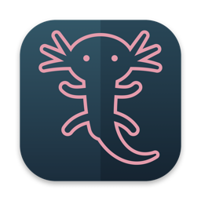

<p align="center">
  
</p>

<h1 align="center">Axolotl Commander</h1>

<p align="center">
  Dvoupanelový správce souborů pro macOS ovládaný z klávesnice.<br>
  <em>A keyboard-driven two-panel file manager for macOS.</em>
</p>

<p align="center">
  <a href="https://github.com/axolotlcommander/axolotl-commander/actions/workflows/ci.yml"></a>
  <a href="LICENSE"></a>
  
</p>

## Proč

Na Windows jsem léta používal Salamander: dva panely, všechno z klávesnice, rychlý náhled
souboru na F3, porovnání souborů i celých složek, archivy a FTP jako obyčejné složky. Na Macu
mi nic takového nesedlo. Finder je na práci se soubory pomalý a hodně věcí v něm vůbec nejde.

Axolotl Commander je pokus mít to samé nativně na Macu, jako opravdovou aplikaci pro macOS
(Swift, AppKit, Koš, Klíčenka, Quick Look, štítky Finderu), ne jako přenesený program pro
Windows.

## Inspirace

Chování, rozložení kláves, příkazy a dialogy vycházejí
z [Tandem Commanderu](https://github.com/tandemcommander/tandemcommander), který navazuje
na [Open Salamander](https://github.com/OpenSalamander/salamander) (dříve Altap Salamander).
Vzorem bylo chování těchto programů a jejich nápověda. Kód je napsaný znovu, nic z jejich
zdrojových kódů se nepřebíralo (viz [NOTICE](NOTICE)).

Axolotl Commander není spojen s autory Tandem Commanderu ani Open Salamanderu a není jimi
podporován.

## Vznik s pomocí AI — čti před použitím

Projekt je z velké části **„vibekódovaný“**: kód psal AI asistent
[Claude Code](https://claude.com/claude-code) od Anthropicu. Správce projektu určuje, co a jak
má program dělat, zkouší ho a rozhoduje o změnách. Ne každý řádek ale prošel podrobnou lidskou
kontrolou.

Co z toho plyne:

- **Je to raná vývojová verze.** Bez záruky, jak říká licence GPL.
- **Bezpečnost dat má přednost.** Operace se soubory mají sady automatických testů
  (přes 600, jen v dočasných složkách), například úplný zápis před nahrazením souboru,
  identitu souborů místo porovnávání textu cest, odmítnutí kopie „do sebe“ nebo mazání do
  Koše s jasným přehledem, co se nepodařilo. Přesto platí:
- **Na důležitých datech mít zálohu** (Time Machine). Chybu prosím nahlas
  v [issues](https://github.com/axolotlcommander/axolotl-commander/issues).
  Pokud může vést ke ztrátě dat, označ ji štítkem `data-safety`.

## Co umí

- **Panely:** dva panely se záložkami, podrobné i stručné zobrazení, řazení, filtry, výběr
  podle masky, oblíbené a nedávné cesty, informace o svazku.
- **Operace:** kopírování, přesun, mazání do Koše, přejmenování (i hromadné, s vrácením ⌘Z),
  nová složka, atributy, práva a štítky Finderu, kontrolní součty, velikosti složek, mapa disku.
  Funguje i drag & drop.
- **Prohlížení:** prohlížeč textu a hexu s rozpoznáním kódování, zalamováním a hledáním.
  Náhled Markdownu, HTML (bez skriptů) a obrázků, plus Quick Look (⌘Y).
- **Porovnání:** porovnání dvou souborů vedle sebe a porovnání obsahu panelů (složek).
- **Archivy:** ZIP, 7z, tar (gz/bz2/xz) se otevírají jako složky, jde do nich kopírovat
  a upravovat jejich obsah. Šifrovaný ZIP a RAR (jen čtení).
- **Servery:** SFTP (přes systémové `ssh`, tedy i s tvým `~/.ssh/config`) a FTP/FTPS, hesla
  v Klíčence, kódování názvů pro starší servery.
- **Hledání:** podle jména a obsahu, hledání duplicit, výsledky jdou poslat do panelu.
- **Přizpůsobení:** příkazová řádka, uživatelské menu (F9), vlastní klávesové zkratky.
  Rozhraní česky a anglicky.

## Instalace

### Hotová aplikace

1. Z [Releases](https://github.com/axolotlcommander/axolotl-commander/releases) stáhni
   `Axolotl-Commander-<verze>.dmg` (nebo `.zip`). Aplikace je univerzální, běží na Apple
   Silicon i Intelu a potřebuje **macOS 15 Sequoia nebo novější**.
2. Přetáhni **Axolotl Commander** do složky **Aplikace**.
3. **První spuštění:** dokud vydání nejsou podepsaná certifikátem Apple Developer ID, macOS
   aplikaci zablokuje se zprávou, že ji nelze ověřit. Klikni na *Hotovo* a pak
   v *Nastavení systému → Soukromí a zabezpečení* dole u Axolotl Commanderu na
   *Přesto otevřít*. Stačí to jednou.

Kontrolní součty stažených souborů jsou u vydání v `SHA256SUMS.txt`.

### Ze zdrojových kódů

Potřebuješ macOS 15+ a Swift 6.2: buď Xcode 26, nebo jen Command Line Tools
(`xcode-select --install`).

```sh
git clone https://github.com/axolotlcommander/axolotl-commander.git
cd axolotl-commander

swift run AxolotlCommander     # rychlé spuštění bez instalace
swift test                     # testy jádra (běží jen v dočasných složkách)

scripts/bundle.sh release      # sestaví build/Axolotl Commander.app
scripts/install.sh             # nainstaluje do ~/Applications a dá alias na plochu
```

`scripts/install.sh` před instalací **ukončí běžící Axolotl Commander** a nahradí ho novou
verzí. `UNIVERSAL=1 scripts/bundle.sh release` sestaví aplikaci pro obě architektury.

## První kroky

**Funkční klávesy.** Na Macu F1–F12 ve výchozím stavu ovládají jas, hlasitost a podobně.
Buď drž `fn`, nebo zapni *Nastavení systému → Klávesnice → Klávesové zkratky → Funkční
klávesy → Používat klávesy F1, F2 atd. jako standardní funkční klávesy*. Kolize se systémovými
zkratkami (Mission Control, Spotlight) se dají vyřešit v nastavení aplikace (⌘,) pod
*Klávesnice*, kde jde každý příkaz přemapovat.

| Klávesa | Příkaz | Klávesa | Příkaz |
|---|---|---|---|
| Tab | přepnout panel | F7 | nová složka |
| F2 | přejmenovat | F8 | do Koše |
| F3 | zobrazit | ⇧F8 | smazat natrvalo |
| F4 | upravit | F9 | uživatelské menu |
| F5 | kopírovat | ⌃F10 | porovnat panely |
| F6 | přesunout | ⌘Y | Quick Look |
| ⌘F | hledat soubory | ⌘K | připojit k serveru |
| ⇧F7 / ⌘⇧G | přejít do složky | ⌘, | nastavení |

Všechny příkazy a jejich zkratky jsou v menu.

**Oprávnění.** Při prvním vstupu do Plochy, Dokumentů, Stažených souborů nebo na síťový či
vyměnitelný disk se macOS zeptá, jestli to aplikaci dovolíš. Kvůli složkám chráněným systémem
(například `~/Library/Mail`) jde aplikaci přidat do *Soukromí a zabezpečení → Plný přístup
k disku*. Není to ale nutné.

**Odinstalace.** Smaž aplikaci a případně nastavení
`~/Library/Preferences/cz.acidek.axolotlcommander.plist` a složku
`~/Library/Application Support/Axolotl Commander`. Uložená hesla k serverům najdeš
v aplikaci Klíčenka, mají v názvu „(Axolotl Commander)“.

## Přispívání

Pomoc je vítaná: hlášení chyb, nápady, překlady i pull requesty. Návod je
v [CONTRIBUTING.md](CONTRIBUTING.md). Dvě pravidla jsou závazná:

- testy pracují jen v dočasných složkách, nikdy ne na skutečných datech,
- implementace je čistá, zdrojové kódy vzoru se nečtou ani nekopírují.

Platí [pravidla chování](CODE_OF_CONDUCT.md). Bezpečnostní chyby hlas podle
[SECURITY.md](SECURITY.md). Seznam změn je v [CHANGELOG.md](CHANGELOG.md).

## Poděkování

Díky autorům Open Salamanderu a Tandem Commanderu za desítky let práce na správci souborů
ovládaném z klávesnice a za to, že ho uvolnili jako svobodný software (GPL-2.0-or-later).
Díky také autorům knihoven, které aplikace používá: libarchive, libcurl, swift-markdown, cmark
(viz [THIRD_PARTY.md](THIRD_PARTY.md)).

## Licence

Axolotl Commander je svobodný software pod licencí [GNU GPL verze 3 nebo novější](LICENSE)
(`GPL-3.0-or-later`). Autoři: [AUTHORS](AUTHORS).

---

### In English

Axolotl Commander is a native, keyboard-driven two-panel (dual-pane, orthodox) file manager for
macOS, for anyone missing Salamander, Total Commander or Norton Commander-style file management
on the Mac. Its behavior,
key layout and dialogs are modeled on [Tandem Commander](https://github.com/tandemcommander/tandemcommander)
and [Open Salamander](https://github.com/OpenSalamander/salamander). It is written from
scratch in Swift and AppKit and is not affiliated with either project.

**Heads-up:** most of the code was written with the AI assistant Claude Code ("vibe-coded").
The maintainer steers the behavior and tests the app, but not every line has had a detailed
human review. File operations are covered by an extensive test suite, but this is early
software. Keep backups and report bugs, especially anything that could lose data.

Download the universal app (macOS 15+) from [Releases](https://github.com/axolotlcommander/axolotl-commander/releases).
Until the builds are notarized, allow the first launch in *System Settings → Privacy &
Security → Open Anyway*. To build it yourself: `swift run AxolotlCommander`, or
`scripts/bundle.sh release`. Contributions in English are welcome, see
[CONTRIBUTING.md](CONTRIBUTING.md).
